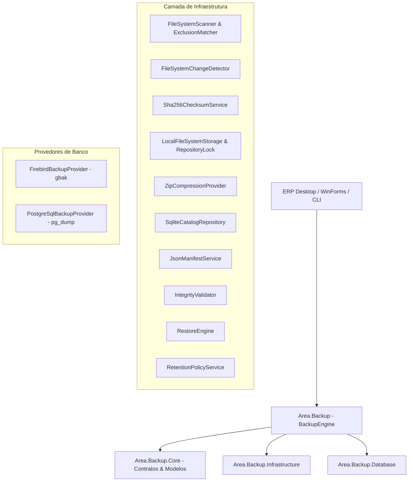
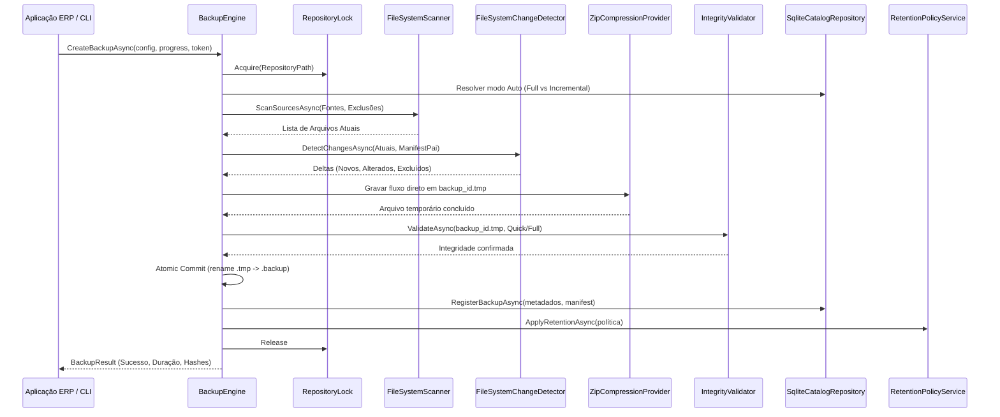

# Arquitetura do Area Backup Engine

## 1. Visão Geral da Arquitetura

O **Area Backup Engine** foi concebido sob princípios rigorosos de **engenharia de software para resiliência e integridade de dados**, separando categoricamente as camadas de domínio, infraestrutura, acesso a dados, camada de banco de dados e fachadas de aplicação.

---

## 2. Pipeline de Execução de Backup

O ciclo de criação de backup executa em 10 etapas sequenciais e assíncronas:

---

## 3. Princípios Fundamentais de Design

1. **Prioridade Absoluta da Integridade**:
   - Integridade > Segurança > Restauração > Confiabilidade > Performance > Espaço.
   - Nenhum backup parcial é considerado válido. O backup é escrito em `.tmp` e só é promovido a `.backup` após validação completa.

2. **Zero Duplicação Intermediária de Pastas (Direct Streaming)**:
   - A leitura da origem é feita diretamente para o fluxo de compactação do arquivo de destino via buffers gerenciados (`64 KB`), sem copiar pastas para `C:\Temp` antes de compactar.

3. **Invariante de Retenção de Dependências**:
   - Um backup FULL **nunca** é excluído enquanto houver backups incrementais que dependam dele na cadeia de recuperação.

4. **Isolamento de Banco de Dados Ativo**:
   - Arquivos `.fdb` ou bases de dados em uso nunca são copiados via `File.Copy`. São acionadas as ferramentas nativas (`gbak`, `pg_dump`) para gerar dumps transacionais consistentes.
